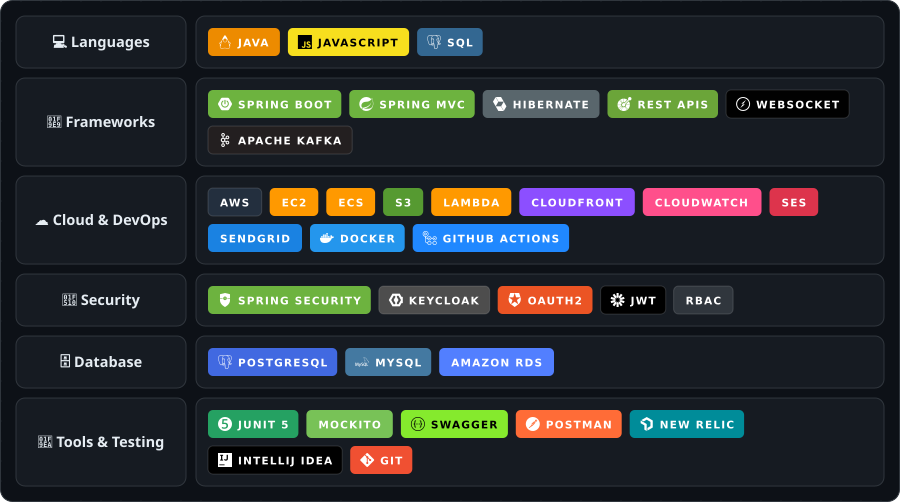

<!-- ============================ HEADER ============================ -->

  <picture><source media="(prefers-color-scheme: light)" srcset="./assets/terminal-light.svg"></picture>

  
  
  

<!-- ======================= IMPACT AT A GLANCE ======================= -->

  <picture><source media="(prefers-color-scheme: light)" srcset="./assets/metrics-light.svg"></picture>

---

## 👨‍💻 About Me

  <picture><source media="(prefers-color-scheme: light)" srcset="./assets/about-light.svg"></picture>

---

## 🛠️ Tech Stack

  <picture><source media="(prefers-color-scheme: light)" srcset="./assets/techstack-light.svg"></picture>

---

## 🏗️ How I Build — Request Lifecycle

> One request, end to end: in through the gateway, authenticated by Keycloak, served from PostgreSQL, answered back to the user, then fanned out through Kafka to an email and a live WebSocket update.

  <picture><source media="(prefers-color-scheme: light)" srcset="./assets/architecture-light.svg"></picture>

---

## 💼 Experience

  <picture><source media="(prefers-color-scheme: light)" srcset="./assets/experience-light.svg"></picture>

---

## 🚀 Featured Work

  <picture><source media="(prefers-color-scheme: light)" srcset="./assets/projects-light.svg"></picture>

---

## 📊 GitHub Activity

  <picture><source media="(prefers-color-scheme: light)" srcset="https://streak-stats.demolab.com?user=Janar210&theme=default&hide_border=true&background=FFFFFF&ring=0969DA&fire=8250DF&currStreakLabel=0969DA"></picture>

  <picture><source media="(prefers-color-scheme: light)" srcset="./assets/activity-light.svg"></picture>

<!-- Drawn daily by scripts/snake_grid.mjs (see .github/workflows/activity.yml) -->

  <picture>
    <source media="(prefers-color-scheme: dark)" srcset="./assets/snake.svg" />
    <source media="(prefers-color-scheme: light)" srcset="./assets/snake-light.svg" />
    
  </picture>

---

## 🎓 Education

  <picture><source media="(prefers-color-scheme: light)" srcset="./assets/education-light.svg"></picture>

---

  <picture><source media="(prefers-color-scheme: light)" srcset="./assets/quote-light.svg"></picture>

  
  

  <picture><source media="(prefers-color-scheme: light)" srcset="./assets/status-light.svg"></picture>

