<!-- ============================ HEADER ============================ -->

  

  
  
  

<!-- ======================= IMPACT AT A GLANCE ======================= -->

  

---

## 👨‍💻 About Me

  

---

## 🛠️ Tech Stack

<table>
<tr>
<td align="center" width="170"><b>💻 Languages</b></td>
<td>

</td>
</tr>
<tr>
<td align="center" width="170"><b>🧩 Frameworks</b></td>
<td>

</td>
</tr>
<tr>
<td align="center" width="170"><b>☁️ Cloud & DevOps</b></td>
<td>

</td>
</tr>
<tr>
<td align="center" width="170"><b>🔐 Security</b></td>
<td>

</td>
</tr>
<tr>
<td align="center" width="170"><b>🗄️ Database</b></td>
<td>

</td>
</tr>
<tr>
<td align="center" width="170"><b>🧪 Tools & Testing</b></td>
<td>

</td>
</tr>
</table>

---

## 🏗️ How I Build — Request Lifecycle

> One request, end to end: in through the gateway, authenticated by Keycloak, served from PostgreSQL, answered back to the user, then fanned out through Kafka to an email and a live WebSocket update.

  

---

## 💼 Experience

  

---

## 🚀 Featured Work

  

---

## 📊 GitHub Activity

  

  

<!-- Needs .github/workflows/snake.yml (see below) -->

  <picture>
    <source media="(prefers-color-scheme: dark)" srcset="./assets/snake.svg" />
    <source media="(prefers-color-scheme: light)" srcset="./assets/snake.svg" />
    
  </picture>

---

## 🎓 Education

  

---

  

  
  

  

